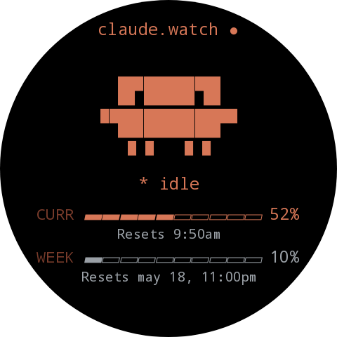
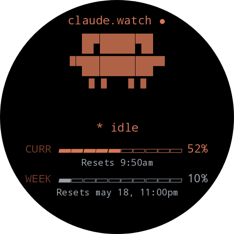
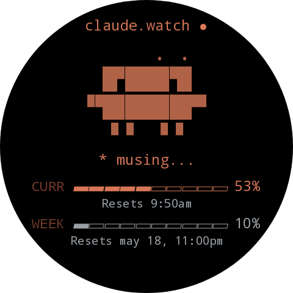
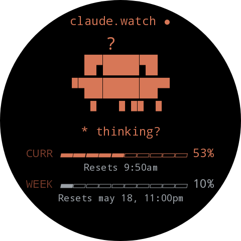
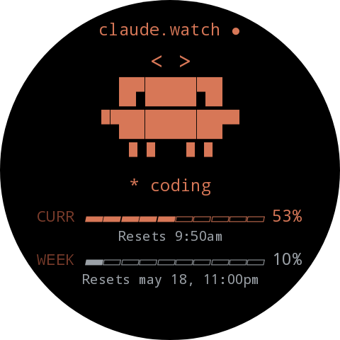
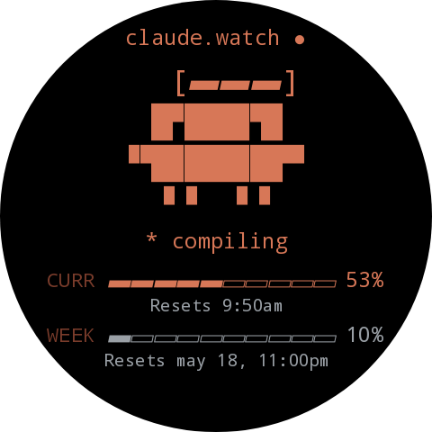
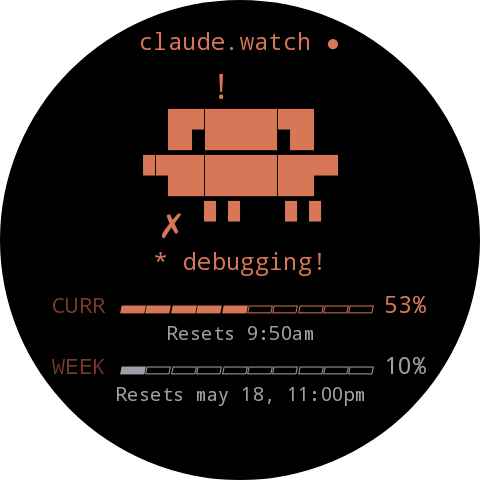
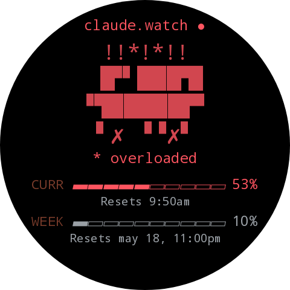
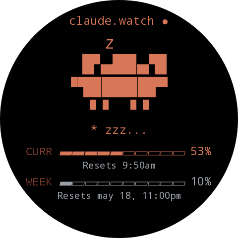

<div align="center">

# wearos-claude

**A retro, local-first Claude Code telemetry dashboard for your wrist.**

<table>
  <tr>
    <td align="center">
      
    </td>
    <td align="center">
      
    </td>
  </tr>
  <tr>
    <td align="center"><sub><i>Live on a Galaxy Watch 6 Classic</i></sub></td>
    <td align="center"><sub><i>Dashboard close-up</i></sub></td>
  </tr>
</table>

A pixel-art Claude mascot, a Wear OS tile, and a tiny local daemon backend that
talks straight to Anthropic for the real 5-hour and 7-day usage numbers
Claude Code itself sees.

[Quick start](#quick-start) · [How it works](#how-it-works) · [Setup](docs/SETUP.md) · [Architecture](docs/ARCHITECTURE.md) · [Debugging](docs/DEBUG.md)

</div>

---

## ⚠️ Project status — read this first

This is a **personal prototype**. It runs on my Galaxy Watch 6 Classic and my
Linux Computer. It is shared publicly because someone else might find it
useful, not because it is production-grade.

In particular:

- **Use at your own risk.** Nothing here is officially supported by Anthropic.
- **Telemetry is best-effort.** The "real" usage numbers come from Anthropic's
  `anthropic-ratelimit-unified-*` response headers, which are an
  implementation detail of Claude Code and can change without notice.
- **The OAuth probe costs one message per probe.** The default cadence
  (every 10 minutes) burns about 30 messages per 5-hour window. You can
  raise that interval or disable the probe entirely.
- **Networking is HTTP over your LAN.** The watch reaches the host directly,
  no cloud, no proxy. If your watch and your laptop aren't on the same
  Wi-Fi, this won't work.
- **The Wear OS surface is Wear OS 3+ only.** It was developed and tested on
  a Galaxy Watch 6 Classic; other Wear OS devices probably work but are
  untested.
- **Expect breakage.** The Anthropic headers, the Claude Code JSONL layout,
  and the Wear OS ProtoLayout API are all moving targets.

If any of that is a dealbreaker, please don't deploy this.

---

## What it does

`wearos-claude` puts a Claude Code telemetry HUD on a Wear OS watch:

- 🪄 **Zero plan configuration.** The backend reads your usage from
  Anthropic's response headers and infers your plan tier from your Claude
  Code OAuth credentials. You never enter a token budget.
- 🐾 **A live Claude mascot** that idles, breathes, and changes mood based
  on usage and recent activity. Tap to cycle moods; long-press for settings.
- ⏱️ **Real 5-hour usage**, read from Anthropic's ratelimit headers via a
  cheap 1-token probe. Same numbers Claude Code itself displays.
- 📅 **Weekly usage** with a human countdown to reset (`may 18, 11pm`).
- 🟧 **A Wear OS Tile** so the dashboard lives one swipe from your watch
  face — no app launch required.
- 🔌 **A local Fastify backend** that exposes a single `GET /usage` JSON
  endpoint. The watch polls it over Wi-Fi.
- 🖥️ **Retro terminal aesthetic** — pure black canvas, warm Claude-Code
  orange (`#D77757`), monospaced ASCII progress bars, glow-pulse mascot.
- 🏠 **Local-first.** No accounts, no cloud, no analytics. The only outbound
  traffic is your own backend probing `api.anthropic.com` with your own
  OAuth credentials.

---

## Mascot moods

Eight resting expressions, all rendered as pure ASCII so they inherit the
watch's monospace font. Tap the mascot on the watch to cycle through them
manually; otherwise the backend picks one for you.

<table>
  <tr>
    <td align="center"><br/><sub><code>idle</code></sub></td>
    <td align="center"><br/><sub><code>musing</code></sub></td>
    <td align="center"><br/><sub><code>thinking</code></sub></td>
    <td align="center"><br/><sub><code>coding</code></sub></td>
  </tr>
  <tr>
    <td align="center"><br/><sub><code>compiling</code></sub></td>
    <td align="center"><br/><sub><code>debugging</code></sub></td>
    <td align="center"><br/><sub><code>overloaded</code></sub></td>
    <td align="center"><br/><sub><code>sleeping</code></sub></td>
  </tr>
</table>

---

## How it works

```
┌──────────────────┐         ┌─────────────────────┐         ┌────────────────────┐
│ Anthropic        │ headers │  Local Fastify      │   HTTP  │  Wear OS app       │
│ /v1/messages     │ ─────▶ │ backend (this repo) │  ────▶ │  Tile + Activity   │
│ (1-token probe)  │         │  + JSONL fallback   │ /usage  │  (Compose + Tiles) │
└──────────────────┘         └─────────────────────┘         └────────────────────┘
        ▲                              ▲                              │
        │ OAuth token                  │ reads                        │ taps / refresh
        │                              │ ~/.claude/projects/*.jsonl   ▼
┌──────────────────┐         ┌─────────────────────┐           ┌────────────────────┐
│ ~/.claude/       │         │  Mood engine + mascot frames    │  Galaxy Watch 6    │
│ .credentials.json│         │  + 15s payload cache            │  Classic (paired)  │
└──────────────────┘         └─────────────────────────────────┴────────────────────┘
```

Three pieces, one wire contract, no cloud:

1. **`backend/`** — Fastify + TypeScript. Reads the OAuth token Claude Code
   already saved to `~/.claude/.credentials.json`, sends a 1-token probe to
   `POST /v1/messages`, and reads the `anthropic-ratelimit-unified-*`
   response headers. Falls back to aggregating local `~/.claude/projects/*.jsonl`
   transcripts if the probe is unavailable. Single endpoint: `GET /usage`.

2. **`wearos/`** — Kotlin + Compose for Wear OS. One Activity, one Tile, one
   complication. Polls the backend every 60 s while the activity is open;
   the Tile re-renders every 60 s while it's on the carousel.

3. **`shared/usage-contract.ts`** — the wire schema. `data/UsagePayload.kt`
   mirrors it.

This project is **Claude Code only**. There is no generic provider
abstraction, no OpenAI support, no API-key telemetry path. Fork it if you
need something else.

---

## Quick start

This is a NPM Workspace with two packages:

- the `backend/` Fastify server
- the `wearos/` Wear OS app. (not listed in the root `package.json` since it doesn't run on Node.js)

So you can install dependencies from the root of the repo

```bash
# 1. Backend — no config required, the defaults work out of the box.
npm install
npm run dev                # → listening on http://0.0.0.0:47823

# 2. Sanity-check it
curl -s http://localhost:47823/health
npm run probe              # one-shot dump of what /usage would return

# 3. Wear OS app  (from repo root)
scripts/build-apk.sh       # auto-detects your LAN IP
scripts/install-watch.sh   # adb install -r onto a paired watch
```

The full setup walkthrough — including ADB-over-Wi-Fi pairing on a Galaxy
Watch 6 Classic — lives in [`docs/SETUP.md`](docs/SETUP.md).

### What's auto-detected vs. configurable

|                              | Auto-detected                                                                                                 | Override?                             |
| ---------------------------- | ------------------------------------------------------------------------------------------------------------- | ------------------------------------- |
| Current 5h usage %           | Anthropic `anthropic-ratelimit-unified-5h-utilization` header                                                 | no — Anthropic is the source of truth |
| Weekly 7d usage %            | Anthropic `anthropic-ratelimit-unified-7d-utilization` header                                                 | no                                    |
| Reset times                  | Anthropic `anthropic-ratelimit-unified-*-reset` headers                                                       | no                                    |
| Plan tier (Pro / Max / Team) | `subscriptionType` + `rateLimitTier` in `~/.claude/.credentials.json` — used only for the JSONL fallback path | no                                    |
| Probe cadence                | default 10 min                                                                                                | `OAUTH_PROBE_INTERVAL_MINUTES`        |
| Whether to probe at all      | default on                                                                                                    | `OAUTH_PROBE_DISABLED=1`              |
| LAN auth shared secret       | off                                                                                                           | `AUTH_TOKEN`                          |
| Claude Code data root        | `~/.claude`                                                                                                   | `CLAUDE_HOME`                         |

That's the entire config surface. The four `*_TOKEN_BUDGET` /
`*_WINDOW_MINUTES` knobs that earlier versions exposed are gone — the
numbers are either reported by Anthropic or inferred from your subscription.

---

## Features

| Feature                                                                 | Where                                                 |
| ----------------------------------------------------------------------- | ----------------------------------------------------- |
| Live 5-hour and 7-day usage percentages                                 | OAuth probe (Anthropic ratelimit headers)             |
| Local JSONL fallback when the probe is off                              | `backend/src/collectors/claudeCode.ts`                |
| Animated ASCII Claude mascot, 9 moods                                   | `wearos/.../mascot/MascotFrames.kt`                   |
| Wear OS Tile (one swipe from watch face)                                | `wearos/.../tile/UsageTileService.kt`                 |
| Watch-face complication (`SHORT_TEXT` + `RANGED_VALUE`)                 | `wearos/.../complication/UsageComplicationService.kt` |
| Reset times in your local timezone                                      | `wearos/.../ui/ResetFormat.kt`                        |
| 10-cell unicode progress bars (`▰▰▰▰▱▱▱▱▱▱`)                            | `wearos/.../ui/ResetFormat.kt`                        |
| Tap mascot to cycle mood (5 s hold)                                     | `wearos/.../MainActivity.kt`                          |
| Long-press → on-watch settings (backend URL, token)                     | `wearos/.../ui/SettingsScreen.kt`                     |
| Optional shared-secret auth (`x-wearos-claude-token`)                   | `backend/src/routes/usage.ts`                         |
| 15-second backend cache so Tile + Activity + complication share a fetch | `backend/src/routes/usage.ts`                         |

---

## Prerequisites

| Tool                    | Version             | Why                                                 |
| ----------------------- | ------------------- | --------------------------------------------------- |
| Linux host              | recent              | development was done on Manjaro; any distro works   |
| Node.js                 | ≥ 20                | backend runtime                                     |
| `npm`                   | bundled with Node   | dep install + scripts                               |
| `curl` and `jq`         | any                 | `scripts/sample-payload.sh` uses both               |
| `adb` (`android-tools`) | recent              | sideload the APK over Wi-Fi                         |
| Android Studio          | Iguana+             | only required if you want to edit the app in an IDE |
| Android SDK             | API 35              | the build needs `compileSdk = 35`                   |
| JDK                     | 17                  | Gradle compile target                               |
| Wear OS device          | Wear OS 3 (API 30)+ | tested on a Galaxy Watch 6 Classic                  |
| Same Wi-Fi network      | —                   | the watch reaches the host directly                 |
| Claude Code             | recent              | the probe reads `~/.claude/.credentials.json`       |

### Installing prerequisites (Arch / Manjaro example)

```bash
sudo pacman -S nodejs npm jq curl android-tools jdk17-openjdk
# Android SDK platforms can be fetched via Android Studio's SDK Manager.
```

For other distros, install equivalents from your package manager.

---

## Setup

The TL;DR is in [Quick start](#quick-start). The detailed walkthrough is
[`docs/SETUP.md`](docs/SETUP.md). It covers:

1. Cloning the repo and installing dependencies
2. Configuring `backend/.env` (only `AUTH_TOKEN` is worth setting; defaults
   are sane)
3. Starting the backend on `http://0.0.0.0:47823`
4. Finding your LAN IP and baking it into the APK
5. **Enabling developer mode + ADB-over-Wi-Fi on the watch** — full
   step-by-step, beginner friendly
6. `adb connect`-ing the watch from Linux
7. Installing the APK and launching it
8. Adding the Tile and the watch-face complication

---

## Commands

All scripts assume you run them from the repo root.

| Command                             | What it does                                                |
| ----------------------------------- | ----------------------------------------------------------- |
| `scripts/dev.sh`                    | install backend deps (if missing) and run `npm run dev`     |
| `scripts/probe.sh`                  | call `GET /usage` against localhost and pretty-print        |
| `npm run probe` (inside `backend/`) | dump what `/usage` would return, without booting Fastify    |
| `scripts/lan-ip.sh`                 | print the host's LAN IP (used by build-apk.sh)              |
| `scripts/build-apk.sh`              | build a debug APK with backend URL + token baked in         |
| `scripts/install-watch.sh`          | `adb install -r` the debug APK and start the activity       |
| `scripts/uninstall-watch.sh`        | remove both `debug` and `release` flavors from the watch    |
| `scripts/sample-payload.sh [host]`  | print the live `/usage` JSON, optionally from a remote host |

Backend npm scripts (`cd backend`):

| Script              | Use                                  |
| ------------------- | ------------------------------------ |
| `npm run dev`       | `tsx watch` — live-reload TypeScript |
| `npm run build`     | TypeScript → `dist/`                 |
| `npm run start`     | run the compiled server from `dist/` |
| `npm run typecheck` | `tsc --noEmit`                       |
| `npm run probe`     | one-shot `/usage` dump               |

Gradle (from `wearos/`):

```bash
./gradlew :app:assembleDebug \
    -Pwearosclaude.backendUrl=http://192.168.1.7:47823 \
    -Pwearosclaude.authToken=$(grep AUTH_TOKEN ../backend/.env | cut -d= -f2 | tr -d '"')
```

`scripts/build-apk.sh` wraps this. Use it.

---

## ADB + Wear OS — beginner-friendly guide

```
[ Galaxy Watch ]                          [ Linux laptop ]
       │                                         │
       │ 1. Settings → About → Software          │
       │    tap "Software version" 7×            │
       │    "Developer options" unlocked         │
       │                                         │
       │ 2. Settings → Developer options:        │
       │    • ADB debugging              ─► on   │
       │    • Wireless debugging         ─► on   │
       │                                         │
       │ 3. (First time only) "Pair new device"  │
       │    shows a 6-digit code + IP:PAIR-port  │
       │ ──────────────────────────────────────► │
       │                            adb pair 192.168.x.y:<pair-port>
       │                            (enter the 6-digit code)
       │                                         │
       │ 4. Back on the main "Wireless           │
       │    debugging" screen, note IP:CONN-port │
       │ ──────────────────────────────────────► │
       │                            adb connect 192.168.x.y:<conn-port>
       │                            adb devices                  # confirm "device"
       │                                         │
       │                            scripts/install-watch.sh
       │                                         │
       │ 5. Tile carousel → + → claude.watch     │
       │ 6. Tap tile to open the dashboard.      │
```

> **Note:** Wear OS shows **two** ports — one labeled for pairing (`Pair new
> device`) and one on the main wireless-debugging screen for connecting.
> They are different. Pair once with the pairing port; from then on you
> only need `adb connect <ip>:<connect-port>`.

When things go wrong, [`docs/DEBUG.md`](docs/DEBUG.md) has logcat filters,
firewall checks, and tile-stuck-loading recipes.

---

## Architecture (one-paragraph version)

Wear OS app over LAN → local Fastify backend → Anthropic OAuth probe + local
JSONL transcripts. The backend caches `/usage` for 15 s so Tile + Activity +
complication share a single fetch. The watch app polls every 60 s. Mascot
moods are derived on the backend (`backend/src/lib/mood.ts`); frames are
defined in Kotlin (`wearos/.../mascot/MascotFrames.kt`) and the same string
art renders in both Compose `Text` and ProtoLayout `Text` so there's no
bitmap sync to maintain. Full version: [`docs/ARCHITECTURE.md`](docs/ARCHITECTURE.md).

---

## Repository layout

```
wearos-claude/
├── backend/        Fastify + TypeScript usage API (read-only, local)
│   └── src/
│       ├── server.ts            ← entrypoint
│       ├── config.ts            ← env loading
│       ├── usage.ts             ← orchestrator: probe + JSONL → payload
│       ├── collectors/
│       │   ├── anthropicProbe.ts   ← OAuth-token 1-message probe
│       │   └── claudeCode.ts       ← JSONL transcript aggregation
│       ├── routes/usage.ts
│       ├── cli/probe.ts            ← `npm run probe`
│       └── lib/{duration,mood}.ts
├── wearos/         Kotlin + Compose for Wear OS app, Tile, complication
├── shared/         The TypeScript wire contract Kotlin mirrors
├── scripts/        Build, install, dev helpers (bash)
├── docs/           Architecture, setup, debugging, asset rules
└── assets/         Mascot frame reference (Kotlin is the source of truth)
```

---

## Contributing

Pull requests, issues, and forks are all welcome. This is a small project
that benefits from being kept small — please open an issue before sending a
large refactor so we can agree on direction.

See [`CONTRIBUTING.md`](CONTRIBUTING.md) for the lightweight guide,
[`CODE_OF_CONDUCT.md`](CODE_OF_CONDUCT.md) for the obvious-but-required
ground rules, and [`SECURITY.md`](SECURITY.md) for how to report a
vulnerability.

Ideas that would be especially welcome:

- A "burst headroom" indicator using
  `anthropic-ratelimit-unified-fallback-percentage` and `overage`.
- Watchface complication variants (`LONG_TEXT`, `MONOCHROMATIC_IMAGE`).
- A second Tile that surfaces _just_ the mascot, for people who already
  have a complication for the number.
- Wear OS 5 / API 35 + AGP 8.x cleanup as the toolchain moves.

---

## Inspiration & credits

This project owes its entire usage-probing trick to
**[Clawdmeter](https://github.com/HermannBjorgvin/Clawdmeter)** by
Hermann Bjorgvin — an ESP32 desk display that reads the same
`anthropic-ratelimit-unified-*` response headers from the Anthropic
`/v1/messages` endpoint. Without finding Clawdmeter, this project would
still be staring at a hopelessly inaccurate token estimate from local
JSONL files. Massive thanks. 🐾

If you want a _desk_ version of this thing, go look at Clawdmeter. If you
want it on your _wrist_, you're in the right place.

Additional credit:

- The pixel-art Claude silhouette is the same one Claude Code displays in
  its CLI splash, rendered here in Unicode block elements rather than
  bitmaps so it inherits the watch's monospace font.
- The retro orange (`#D77757`) is lifted from the Claude Code CLI palette.
- Wear OS ProtoLayout + Tile examples in the AOSP Horologist samples were
  the reference for the Tile implementation.

---

## Licensing, Disclaimer & Third-Party Assets

This repository is an experimental open-source prototype created for educational, personal, and research purposes.

You are authorized to use, modify, fork, experiment with, and learn from the code contained in this repository at your own risk.

However, please be aware that some visual elements, references, aesthetics, terminology, or assets used throughout this project may relate to or be inspired by Anthropic products, branding, or intellectual property.

This may include, but is not limited to:

- Claude-related references
- Anthropic-inspired visual aesthetics
- mascot-inspired artwork or derivatives
- terminal themes inspired by existing products
- fonts or visual assets that may have separate licensing terms
- telemetry concepts associated with Claude Code

This repository is **not affiliated with, endorsed by, sponsored by, or officially connected to Anthropic** in any way.

All trademarks, product names, logos, mascots, and brand references remain the property of their respective owners.

The code in this repository is provided "as is", without warranty of any kind, express or implied, including but not limited to:

- fitness for a particular purpose
- merchantability
- reliability
- security
- compatibility
- future support

By using, copying, modifying, distributing, or deploying this project, you acknowledge that:

- you are solely responsible for your own usage
- you are responsible for verifying licensing compatibility
- you are responsible for complying with any applicable third-party terms
- you assume all legal and technical risks associated with usage

If you fork or reuse this repository publicly, you are strongly encouraged to:

- replace any potentially copyrighted assets
- replace third-party fonts if necessary
- avoid implying official affiliation with Anthropic
- review applicable brand guidelines and licensing terms

Use responsibly.
